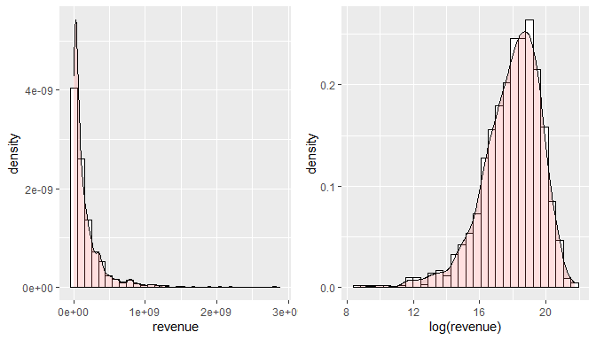
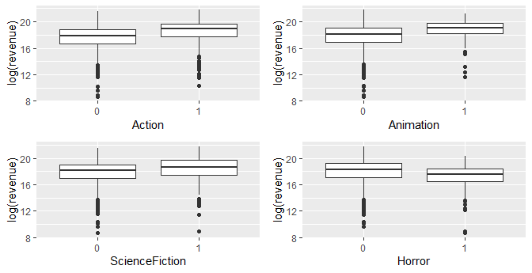
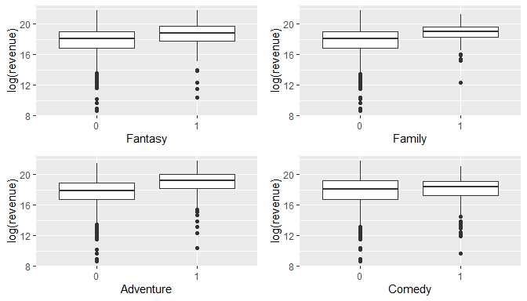
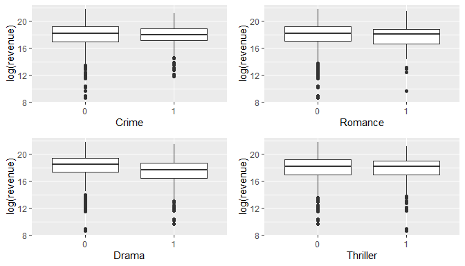
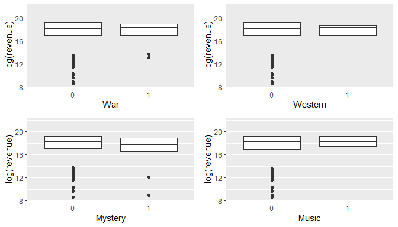
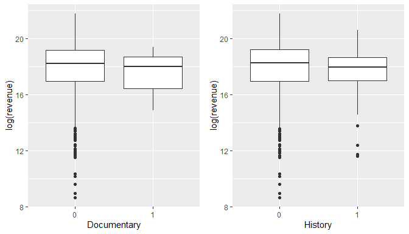
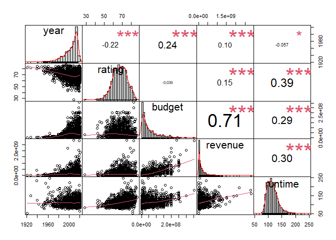
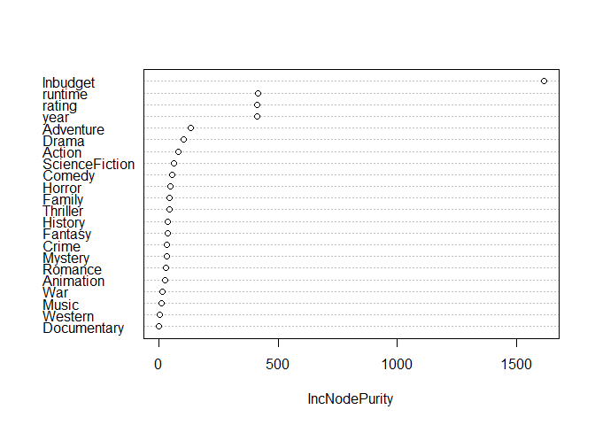
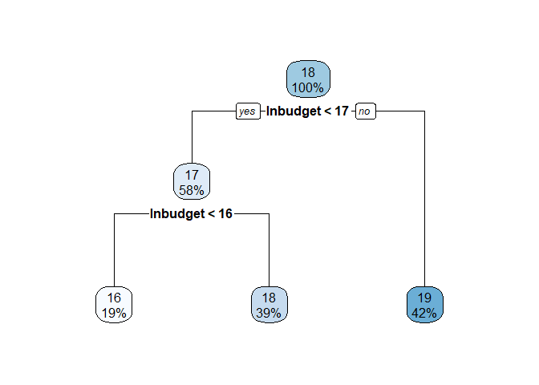

# 1 Introduction

     Revenue prediction is an important problem in the film industry
that governs financial decisions made by producers and investors. Movies
make a high profile, billion dollar industry and prediction of movie
revenue can be very lucrative. Predicted revenues can be used for
planning both the production and distribution stages. For example,
projected gross revenue can be used to plan the remuneration of the
actors and crew members as well as other parts of the budget.  
     Prediction of gross revenue of a movie depends on many factors
including budget, release date, genres, runtime, and ratings. In this
study, these factors will be explored and considered to predict the
gross revenue of movies as accurately as possible. The prediction model
will be constructed based on various movies released from 1921 to 2021.
Four regression models (Linear Model, Decision Trees, Random Forest, and
XGBoost) will be considered and each model performance will be
evaluated.  
     The outline of the remainder of this report is as follows. In
Section 2, the most important characteristics of data are presented.
Model selection and discussion was discussed in Section 3. Concluding
remarks can be found in Section 4 and other details are in the appendix.

# 2 Data Source and Structure

     The data are cross-sectional and gathered online from The Movie
Database (TMDB). The raw text files were then processed with the help of
R script developed during the data cleaning phase. In the process,
movies with zero record on budget or revenue are removed. A total of
1589 observations with 22 independent variables were considered to build
the regression models. More detailed explanations of these variables are
available in A1 of section 5.  
     2019 is the year with the highest number of movies released with
average gross revenue of 202.17 million dollars followed by 2018 with
167.4 million dollars. The movie avatar released in 2009 and The Vault
released in 2017 accumulated the highest and lowest gross revenue with
2.85 billion dollars and 5,728 dollars respectively. Table 2.1 below
provides more details on gross revenue. Figure 2.1 shows the histogram
plot of gross revenue is right skewed. As a consequence, natural
logarithm of the values has been used instead of the actual values. The
independent variable budget was also converted to its natural
logarithmic form before using them in section 3.  

<table style="width:100%;">
<colgroup>
<col style="width: 19%" />
<col style="width: 16%" />
<col style="width: 15%" />
<col style="width: 16%" />
<col style="width: 11%" />
<col style="width: 19%" />
</colgroup>
<thead>
<tr class="header">
<th style="text-align: left;">Variable</th>
<th style="text-align: right;">Mean</th>
<th style="text-align: right;">Median</th>
<th style="text-align: right;">SD</th>
<th style="text-align: right;">Minimum</th>
<th style="text-align: right;">Maximum</th>
</tr>
</thead>
<tbody>
<tr class="odd">
<td style="text-align: left;">Gross Revenue</td>
<td style="text-align: right;">169,220,068</td>
<td style="text-align: right;">78,720,293</td>
<td style="text-align: right;">254,634,523</td>
<td style="text-align: right;">5,728</td>
<td style="text-align: right;">2,847,246,203</td>
</tr>
<tr class="even">
<td style="text-align: left;">Budget</td>
<td style="text-align: right;">47,522,669</td>
<td style="text-align: right;">28,000,000</td>
<td style="text-align: right;">52,290,851</td>
<td style="text-align: right;">30,000</td>
<td style="text-align: right;">356,000,000</td>
</tr>
<tr class="odd">
<td style="text-align: left;">Runtime</td>
<td style="text-align: right;">114</td>
<td style="text-align: right;">111</td>
<td style="text-align: right;">21</td>
<td style="text-align: right;">53</td>
<td style="text-align: right;">248</td>
</tr>
<tr class="even">
<td style="text-align: left;">Rating</td>
<td style="text-align: right;">68</td>
<td style="text-align: right;">69</td>
<td style="text-align: right;">8</td>
<td style="text-align: right;">28</td>
<td style="text-align: right;">87</td>
</tr>
<tr class="odd">
<td style="text-align: left;">Year</td>
<td style="text-align: right;">2,007</td>
<td style="text-align: right;">2,011</td>
<td style="text-align: right;">14</td>
<td style="text-align: right;">1,921</td>
<td style="text-align: right;">2,021</td>
</tr>
</tbody>
</table>

Table 2.1: Movie Gross Revenue
Summary Statistics

Figure 2.1: Histogram of Gross
Revenue

Figure 2.2: Box Plots of Gross
Revenue by Action, Animation, ScienceFiction and Horror

Figure 2.3: Box Plots of Gross
Revenue by Fantasy, Family, Adventure and Comedy

Figure 2.4: Box Plots of Gross
Revenue by Crime, Romance, Drama and Thriller

Figure 2.5: Box Plots of Gross
Revenue by War, Western, Mystery and Music

Figure 2.6: Box Plots of Gross
Revenue by Documentary and History

Figure 2.7: Correlation Plots of
the Continuous Variables in dataset

     To understand the effects of genres on gross revenue, figures 2.2-2.6
presents box plots of gross revenue for each genre. The figures show if
the movie genre are action, animation, science fiction, fantasy, family,
and adventure, the average worldwide revenue is higher compared to
others. On the other hand, if the movie genre are horror, drama, and
mystery, the average worldwide revenue is lower compared to others.  
     Figure 2.7 shows the relationship of gross revenue with independent
variables such as budget, year, runtime and rating. The corresponding
correlation coefficients, histograms and scatter plots are shown as well
to visualize the distributions and relationships of the said variables.
Figure 2.7 shows, gross revenue has strong and moderate positive linear
relationship with budget and runtime respectively. Furthermore, gross
revenue has weak positive linear relationship with year and rating.

# 3 Model Selection and Interpretation

     The main objective of this study is to predict the gross revenue of
a new movie from the historical data available. The data were divided
into 80% training and 20% test sets. The purpose was to fit the models
to training set then use the test set for prediction since there is a
need for the models to be tested on unseen data which will represent the
real world scenario. The models were then evaluated using root mean
square error and R-square. Since there is no concept of R-square in
Gamma regression, deviance was used instead.  
     As a result of this study, I recommend a Random Forest model with
411 number of trees and 8 variables at each split. The parameters were
obtained by hyperparameter tuning. The model was fitted with gross
revenue and budget converted to their natural logarithmic forms to
squish extreme values. Transforming the said variables provided better
prediction compared to models without transformation. All independent
variables were fitted in the model with log-transformed budget, year,
rating and runtime as the most important factors for predicting gross
revenue. Figure 3.1 shows the variable importance plot of the recommended
model. The model provided a reasonable fit to the data since 88.6% of
the variation in log-transformed gross revenue was explained by the
independent variables.  
     A number of competing models were considered. Table 3.1 lists 12
competing models, 2 Random Forest, 7 Decision Trees, 2 XGboost, and 1
Gamma models. The same transformation for budget and gross revenue were
done before fitted in Decision Trees and XGboost models. In contrast, no
transformations was made for the Gamma model. Table 3.1 shows that the
recommended model is the best among the other alternatives given the
lowest root mean square error and highest R-square on the test and train
set respectively. With this, the recommended model has the best
goodness-of-fit and the clear choice among other models.  
     In addition to Decision Trees, Random Forest, XGboost, and Gamma
models, the data was also fitted to linear model with normal
distribution assumption. However, the residuals of the fitted model
didn’t satisfy the normality and constant variance assumption which led
to the consideration of Gamma model because of the skewed distribution
of gross revenue.

Figure 3.1: Variable Importance

<table>
<thead>
<tr class="header">
<th style="text-align: left;">Models</th>
<th style="text-align: right;">RMSE</th>
<th style="text-align: right;">R.Squared</th>
</tr>
</thead>
<tbody>
<tr class="odd">
<td style="text-align: left;">Tuned Random Forest</td>
<td style="text-align: right;">131,196,937</td>
<td style="text-align: right;">0.8836974</td>
</tr>
<tr class="even">
<td style="text-align: left;">Random with Default Parameters</td>
<td style="text-align: right;">132,557,640</td>
<td style="text-align: right;">0.8799257</td>
</tr>
<tr class="odd">
<td style="text-align: left;">XGboost with Default Parameters</td>
<td style="text-align: right;">139,470,471</td>
<td style="text-align: right;">0.7681611</td>
</tr>
<tr class="even">
<td style="text-align: left;">Tuned XGboost</td>
<td style="text-align: right;">149,126,915</td>
<td style="text-align: right;">0.8407353</td>
</tr>
<tr class="odd">
<td style="text-align: left;">Decision Tree with cp = 0 v1</td>
<td style="text-align: right;">156,402,418</td>
<td style="text-align: right;">0.6576574</td>
</tr>
<tr class="even">
<td style="text-align: left;">Decision Tree with cp = 0 v2</td>
<td style="text-align: right;">156,402,418</td>
<td style="text-align: right;">0.6576574</td>
</tr>
<tr class="odd">
<td style="text-align: left;">Tuned Decision Tree</td>
<td style="text-align: right;">160,034,432</td>
<td style="text-align: right;">0.5435033</td>
</tr>
<tr class="even">
<td style="text-align: left;">Pruned Decision Tree v2</td>
<td style="text-align: right;">166,285,621</td>
<td style="text-align: right;">0.5810613</td>
</tr>
<tr class="odd">
<td style="text-align: left;">Pruned Decision Tree v4</td>
<td style="text-align: right;">166,492,029</td>
<td style="text-align: right;">0.5580049</td>
</tr>
<tr class="even">
<td style="text-align: left;">Gamma Model</td>
<td style="text-align: right;">167,151,380</td>
<td style="text-align: right;">NA</td>
</tr>
<tr class="odd">
<td style="text-align: left;">Pruned Decision Tree v1</td>
<td style="text-align: right;">180,346,583</td>
<td style="text-align: right;">0.3839013</td>
</tr>
<tr class="even">
<td style="text-align: left;">Pruned Decision Tree v3</td>
<td style="text-align: right;">180,346,583</td>
<td style="text-align: right;">0.3839013</td>
</tr>
</tbody>
</table>

Table 3.1: Competing Models

# 4 Summary and Conclusion

     The aim of this study was to predict the worldwide gross revenue of
a movie as accurately as possible from publicly available data. The
study was based from 1589 various movies extracted online from The Movie
Database (TMDB) which is sufficient enough to build models for
predicting gross revenue. Four regression methods, Gamma Regression,
Decision Trees, Random Forest, and XGBoost were explored to find the
model that will give the best prediction of gross revenue. Random Forest
model provided the best prediction accuracy compared to others for the
data. Budget, year, runtime, and rating were found to be the most
important variables for predicting the gross revenue. In this study,
budget, year, runtime, rating and genre are the only factors considered.
There are other factors that could have been considered such as
directors and casts. Nonetheless, the recommended model still provided
satisfying prediction accuracy and goodness-of-fit to the data which can
be used immediately to predict gross revenue of new and upcoming movies.

# 5 Appendix

A1. Variable Definitions

A2. Final Fitted Gamma Regression Model: R Output

A3. Simplest Decision Tree Diagram: R Output

  
<table>
<thead>
<tr class="header">
<th style="text-align: left;">Variable Name</th>
<th style="text-align: left;">Description</th>
</tr>
</thead>
<tbody>
<tr class="odd">
<td style="text-align: left;">title</td>
<td style="text-align: left;">Title of the movie</td>
</tr>
<tr class="even">
<td style="text-align: left;">year</td>
<td style="text-align: left;">Year the movie was released</td>
</tr>
<tr class="odd">
<td style="text-align: left;">rating</td>
<td style="text-align: left;">Rating of the movie</td>
</tr>
<tr class="even">
<td style="text-align: left;">budget</td>
<td style="text-align: left;">Budget of the movie in dollars</td>
</tr>
<tr class="odd">
<td style="text-align: left;">revenue</td>
<td style="text-align: left;">Worldwide gross revenue of the movie in
dollars</td>
</tr>
<tr class="even">
<td style="text-align: left;">runtime</td>
<td style="text-align: left;">Length of the movie in minutes</td>
</tr>
<tr class="odd">
<td style="text-align: left;">Action</td>
<td style="text-align: left;">Genre: 1 if yes, 0 if no</td>
</tr>
<tr class="even">
<td style="text-align: left;">Animation</td>
<td style="text-align: left;">Genre: 1 if yes, 0 if no</td>
</tr>
<tr class="odd">
<td style="text-align: left;">ScienceFiction</td>
<td style="text-align: left;">Genre: 1 if yes, 0 if no</td>
</tr>
<tr class="even">
<td style="text-align: left;">Horror</td>
<td style="text-align: left;">Genre: 1 if yes, 0 if no</td>
</tr>
<tr class="odd">
<td style="text-align: left;">Fantasy</td>
<td style="text-align: left;">Genre: 1 if yes, 0 if no</td>
</tr>
<tr class="even">
<td style="text-align: left;">Family</td>
<td style="text-align: left;">Genre: 1 if yes, 0 if no</td>
</tr>
<tr class="odd">
<td style="text-align: left;">Adventure</td>
<td style="text-align: left;">Genre: 1 if yes, 0 if no</td>
</tr>
<tr class="even">
<td style="text-align: left;">Comedy</td>
<td style="text-align: left;">Genre: 1 if yes, 0 if no</td>
</tr>
<tr class="odd">
<td style="text-align: left;">Crime</td>
<td style="text-align: left;">Genre: 1 if yes, 0 if no</td>
</tr>
<tr class="even">
<td style="text-align: left;">Romance</td>
<td style="text-align: left;">Genre: 1 if yes, 0 if no</td>
</tr>
<tr class="odd">
<td style="text-align: left;">Drama</td>
<td style="text-align: left;">Genre: 1 if yes, 0 if no</td>
</tr>
<tr class="even">
<td style="text-align: left;">Thriller</td>
<td style="text-align: left;">Genre: 1 if yes, 0 if no</td>
</tr>
<tr class="odd">
<td style="text-align: left;">War</td>
<td style="text-align: left;">Genre: 1 if yes, 0 if no</td>
</tr>
<tr class="even">
<td style="text-align: left;">Western</td>
<td style="text-align: left;">Genre: 1 if yes, 0 if no</td>
</tr>
<tr class="odd">
<td style="text-align: left;">Mystery</td>
<td style="text-align: left;">Genre: 1 if yes, 0 if no</td>
</tr>
<tr class="even">
<td style="text-align: left;">Music</td>
<td style="text-align: left;">Genre: 1 if yes, 0 if no</td>
</tr>
<tr class="odd">
<td style="text-align: left;">Documentary</td>
<td style="text-align: left;">Genre: 1 if yes, 0 if no</td>
</tr>
<tr class="even">
<td style="text-align: left;">History</td>
<td style="text-align: left;">Genre: 1 if yes, 0 if no</td>
</tr>
</tbody>
</table>

  
    ## 
    ## Call:
    ## glm(formula = revenue ~ budget + rating + Drama + Romance + year + 
    ##     Music + Comedy + Thriller + runtime + Horror + I(budget^2), 
    ##     family = Gamma(link = "log"), data = train2)
    ## 
    ## Coefficients:
    ##               Estimate Std. Error t value Pr(>|t|)    
    ## (Intercept)  3.294e+01  4.421e+00   7.451 1.71e-13 ***
    ## budget       2.924e-08  1.634e-09  17.899  < 2e-16 ***
    ## rating       3.908e-02  4.399e-03   8.884  < 2e-16 ***
    ## Drama       -3.902e-01  7.346e-02  -5.312 1.28e-07 ***
    ## Romance      2.067e-01  9.321e-02   2.218 0.026751 *  
    ## year        -9.289e-03  2.177e-03  -4.268 2.12e-05 ***
    ## Music        4.030e-01  1.927e-01   2.091 0.036691 *  
    ## Comedy       2.775e-01  7.650e-02   3.627 0.000298 ***
    ## Thriller     1.505e-01  7.211e-02   2.088 0.037036 *  
    ## runtime      3.869e-03  1.792e-03   2.159 0.031003 *  
    ## Horror       3.588e-01  9.894e-02   3.626 0.000299 ***
    ## I(budget^2) -6.677e-17  7.525e-18  -8.873  < 2e-16 ***
    ## ---
    ## Signif. codes:  0 '***' 0.001 '**' 0.01 '*' 0.05 '.' 0.1 ' ' 1
    ## 
    ## (Dispersion parameter for Gamma family taken to be 1.103809)
    ## 
    ##     Null deviance: 2615.3  on 1272  degrees of freedom
    ## Residual deviance: 1434.4  on 1261  degrees of freedom
    ## AIC: 49694
    ## 
    ## Number of Fisher Scoring iterations: 25

  
  
  
  
  

